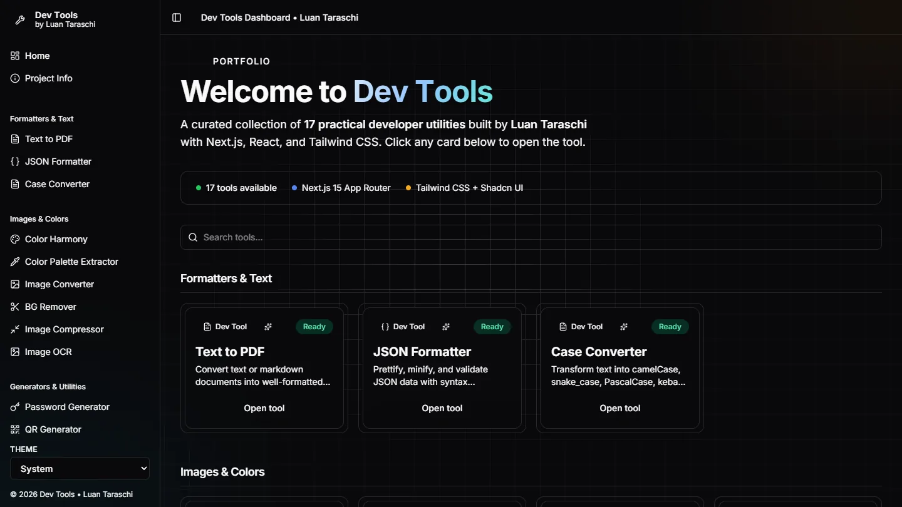

# dev-tools

Seventeen small developer utilities, converters, generators and formatters,
served from one dashboard instead of seventeen browser tabs.

[Live demo](https://dev-tools-xi-beige.vercel.app) · [Case study](https://luantaraschi.dev/en/projeto-devtools.html)



## Overview

The tools are the ordinary ones you reach for mid task and then hunt for
again next week: format this JSON, convert this timezone, generate a QR code,
pull the palette out of this image, turn this scan into text. Each of them
existed on some ad supported site with a cookie banner in the way.

This started as a set of separate Vite apps, one per tool, each with its own
`package.json`, its own build and its own deploy. That does not scale past a
handful. The current repository is the result of collapsing them into a single
Next.js application driven by one registry, and the interesting part of the
project is that consolidation rather than any individual tool.

Almost everything runs in the browser. Nothing you paste, upload or scan is
sent anywhere, with two documented exceptions noted below.

## Architecture

```
app/(dashboard)/layout.tsx      sidebar, theme, search
        |
app/(dashboard)/[tool]/page.tsx one dynamic route for every tool
        |
lib/tools.ts                    the registry: slug -> metadata
        |
components/tools/               per tool client implementations
        |
app/api/remove-bg/route.ts      the one server route
```

`lib/tools.ts` is the single source of truth. Each of the 17 entries is a typed
`ToolDefinition` carrying a slug, an href, a title, a description and one of
five categories, and everything else derives from it: the sidebar list, the
grouped dashboard, the search filter and the routing. Adding a tool means
adding an entry and its component, not creating a route, a layout and a nav
item.

The catch all `[tool]` route resolves the slug through `getToolBySlug` and
renders the matching client component. There is one page shell for all
seventeen tools, so the sidebar, theme handling and layout exist once.

## Engineering Highlights

### One registry, one route, seventeen tools

The alternative was seventeen directories under `app/`, each repeating the
same layout wiring. Routing them through a single dynamic segment means the
tool list, the search filter and the navigation are all derived from the same
array, and they cannot drift out of sync with what actually exists. A slug
that is not in the registry resolves to a "Tool not found" panel with a way
back, handled in one place rather than by a missing directory.

### The API key never reaches the browser

Background removal is the one feature that genuinely needs a third party. Its
API key must not be shipped to the client, where anyone could read it out of
the bundle and spend the quota.

[`app/api/remove-bg/route.ts`](app/api/remove-bg/route.ts) is a thin server
route that holds `REMOVE_BG_API_KEY`, forwards the uploaded file to remove.bg
as multipart form data, and streams the PNG back. It validates that
`image_file` is actually a `File` before forwarding, returns 500 with a clear
message when the key is unset rather than making a doomed request, and passes
the upstream status through on failure instead of flattening every error into
a 500. The response is sent with `Cache-Control: no-store`, since user images
have no business in a shared cache.

### OCR runs on the client, not on a server

The obvious way to build text extraction is to upload the image somewhere.
This build uses `tesseract.js`, so the recognition happens in the visitor's
own browser and the image never leaves the machine. It costs a sizeable
WebAssembly download on first use, which is the honest trade for not
operating an upload endpoint or asking anyone to trust one.

The same reasoning applies across the suite: the JSON formatter, case
converter, UUID generator, colour tools, QR generator, image compressor and
PDF export are all client side, using `jspdf`, `qrcode`, `heic2any` and
canvas APIs.

## Tech Stack

| Layer | Choice | Role in this project |
|---|---|---|
| Framework | Next.js 15, React 19 | App Router, one dynamic route |
| Language | TypeScript | Registry types and tool contracts |
| Styling | Tailwind 4, Radix primitives | Layout, sidebar, tooltips, sliders |
| Motion | Framer Motion | Sidebar and panel transitions |
| Theming | next-themes | Light and dark, persisted |
| Client work | tesseract.js, jspdf, qrcode, heic2any | OCR, PDF, QR, HEIC decoding |
| Server work | remove.bg via one route | Background removal only |

## Testing & Reliability

There is no automated test suite in this repository, and no CI workflow. That
is a real gap, not an omission from this README.

What is enforced: `npm run lint` runs ESLint with `eslint-config-next` under
`--max-warnings=0`, so any warning fails the command, and the project is
TypeScript throughout with the tool registry typed at the boundary. Verified
state is the deployed build linked above, exercised by hand.

The tools that would most repay unit tests are the pure ones: the timezone
converter, the percentage calculator, the case converter and the colour
extraction utilities are all plain input to output functions.

## Running Locally

```bash
npm install
npm run dev
```

Every tool works with no configuration. Background removal additionally needs
a `REMOVE_BG_API_KEY` in `.env.local`; without it that one tool returns a 500
explaining what is missing and the other sixteen are unaffected.

Production build:

```bash
npm run build
npm run start
```

## Known Limitations

- The original standalone Vite apps are still in the repository
  (`bg-remover/`, `color-harmony/`, `color-palette-extractor/`,
  `image-converter/`, `password-generator/`, `qr-generator/`,
  `time-converter/` and `_projetos_originais/`). They are the pre
  consolidation history and are not part of the Next.js build. They should be
  removed once nothing is left to port back.
- No automated tests, as described above.
- OCR quality is whatever `tesseract.js` gives you on a photo taken by hand.

## License

MIT. See [`LICENSE`](LICENSE).
